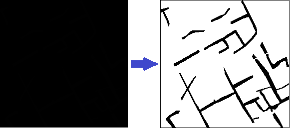
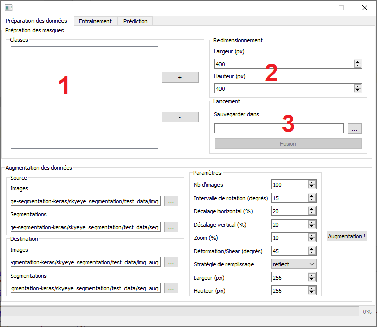
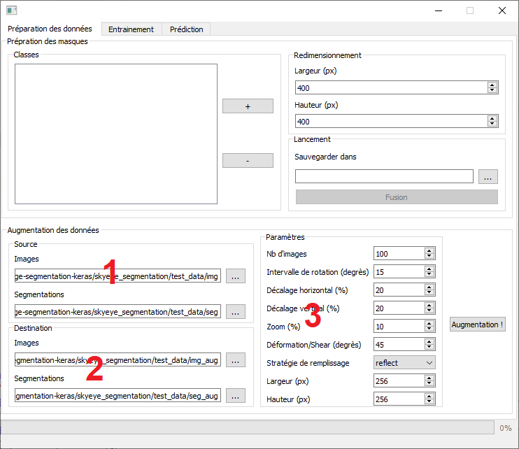
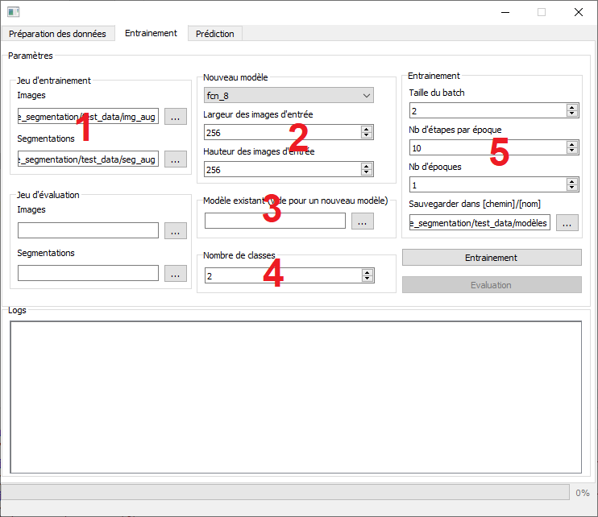
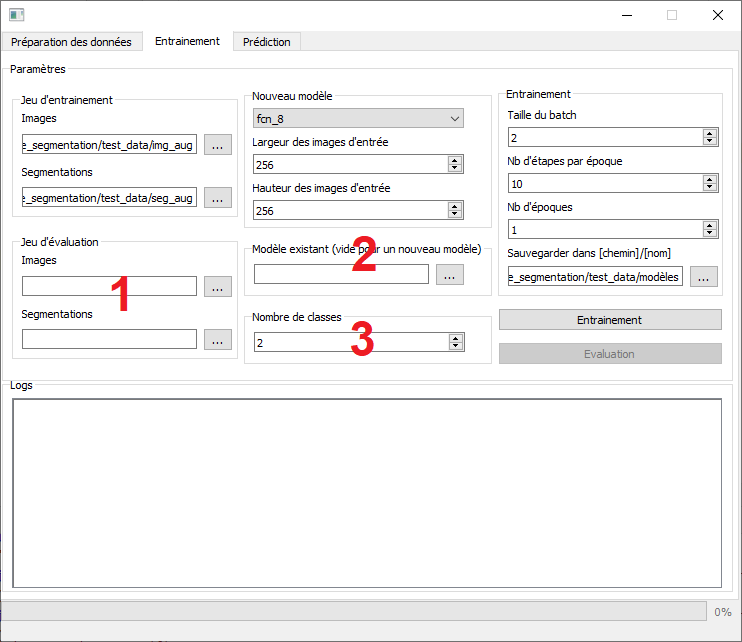
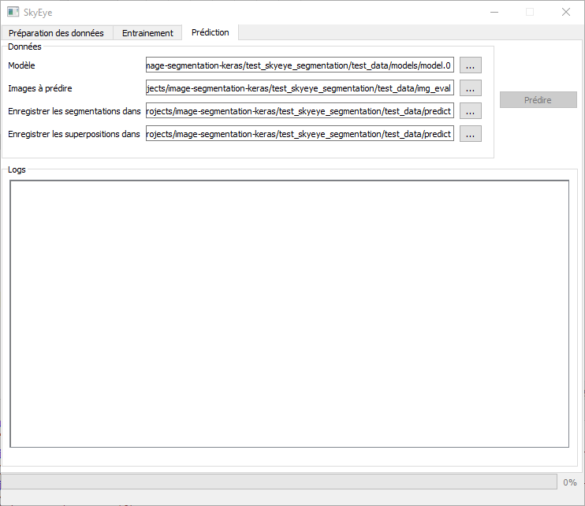

# Manuel d'utilisation SkyEye :book:

L'outil SkyEye permet d'entrainer un modèle de segmentation d'images, d'évaluer ses performances, effectuer des prédictions sur de nouvelles images, et préparer les données en amont de ces opérations.

## Création des masques

Les modèles utilisés travaillent tous avec le même type de données : des images (.jpg, .png, .tif), et leur masque (**doit avoir le même nom**) contenant les segmentations des différentes classes identifiées sur l'image. Les masques sont uniquement constitués de niveaux de gris, et se faisant, peuvent supporter au maximum 255 classes différentes (256 valeurs de gris - la couleur de fond). Par exemple, pour une image contenant des éléments de talus et de charbonnière, les pixels talus auront la valeur de gris 1 et les pixels de charbonnière auront la valeur de gris 2, le fond ayant toujours la valeur 0. De ce fait, ce format de masque est impossible à vérifier à œil nu :

La première fonctionnalité de l'outil, permet de créer ces masques en fusionnant plusieurs segmentations au format .tif en noir et blanc, en spécifiant :

1. Les différents dossiers contenant les segmentation N&B, ex: *talus/* *charb/* **à noter** les masques seront créés en prenant l'ordre de la liste des classes, (0: fond, 1: talus, 2: charb) cet ordre est à noter quelque part car le nom des classes n'est pas conservé dans les autres processus
2. La taille souhaitée des images créées
3. Le dossier ou seront créés les masques

## Augmentation des données

Entrainer des modèles de deep learning nécessite un jeu très conséquent de données (plusieurs centaines, voir milliers d'exemples), dans le cas où la base d'exemple que l'on possède n'est pas aussi fournie, on peut l'*augmenter*, en appliquant des transformations aux images d'origines, on en créé de nouvelles. SkyEye propose cela, il faudra spécifier :

1. Les dossiers images et masques que l'on veut augmenter (notre base d'apprentissage)
2. Les dossiers des futurs images et masques générés
3. Les paramètres de l'augmentation :
   1. Nb d'images : nombre voulu d'images à générer, (+1000 est un bon début)
   2. Intervalle de rotation : pour 15° les images subiront une rotation entre -15° et 15°
   3. Décalage horizontal/vertical : pour 20% les images subiront une translation entre -20% et +20% de leur taille sur l'axe indiqué
   4. Zoom : pour 10% les images subiront un zoom entre -10% et +10%
   5. Déformation (shear)  : [déformation en cisaillement](https://fr.wikipedia.org/wiki/Contrainte_de_cisaillement) de + ou - l'angle indiqué
   6. Stratégie de remplissage : les différentes opérations de transformation ont certainement laissé des "trous" dans l'image (décalage, rotation, etc.), ce paramètre spécifie comment combler ces trous :
      1. 'constant': kkkkkkkk|abcd|kkkkkkkk (k=0 ici)
      2. 'nearest': aaaaaaaa|abcd|dddddddd
      3. 'reflect': abcddcba|abcd|dcbaabcd
      4. 'wrap': abcdabcd|abcd|abcdabcd
   7. Taille des images générées (redimensionnement)

## Entrainement du modèle

Une fois qu'on dispose d'un jeu d'entrainement suffisamment fourni, on peut commencer à entrainer un modèle, il faudra alors spécifier :

1. Le dossier contenant les images et le dossier contenant les segmentations de notre jeu d'entrainement

2. **Si on veut créer un nouveau modèle** : Sélectionner le modèle souhaité, et définir les tailles des images de notre jeu d'entrainement

3. **Si on veut utiliser un modèle qu'on a déjà créé** : sélectionner le fichier du modèle (laisser ce champs vide si on veut en créer un nouveau), **Attention**: les images du jeu d'entrainement devront coller aux dimensions qu'on a défini lorsque le modèle à utiliser a été créé.

4. Le nombre de classes du modèle (ie. le nombre de niveaux de gris de nos masques), par exemple pour un masque contenant les classes TALUS et CHARB, ce nombre vaudra **3** (2 + 1, la classe "fond"). Si cette valeur ne colle pas avec les masques du jeu d'entrainement, ou le nombre de classes pour lesquelles le modèle existant qu'on voudrait utiliser a été créé, une erreur surviendra.

5. Les paramètres de l'entrainement :

   1. Taille du batch : combien d'images vont être montées en mémoire par itération, une plus grande valeur pourra produire un entrainement de meilleure qualité, mais sera plus couteux en ressources  (RAM et CPU)

   2. Nb d'étapes par époque : nombre d'itération par entrainement, on essai en général d'utiliser toute notre base d'entrainement, donc si je dispose 1000 images, et que 5 images sont utilisées  à chaque itération, je spécifierais 1000/5 = 200 itérations

   3. Nb d'époques : nombre d'entrainements que je souhaite effectuer

   4. Sauvegarder dans : endroit où sauvegarder les modèles entrainés + **un nom de modèle**, un fichier sera généré à chaque époque, par exemple si je spécifie *modele/test*, pour 3 époques j'aurais :

      - *modele/test.0* : modèle à l'issue de la première époque

      - *modele/test.1* : deuxième

      - *modele/test.2* : troisième

      - *modele/test_config.json* : contient des informations pour le logiciel

        

### Modèles disponibles

Liste des modèles disponibles et leurs contraintes :

- fcn_8 : réseau complètement convolutionnel
- fcn_32 : même structure, moins précis
- fcn_8_vgg : fcn_8 avec les poids du modèle [vgg](http://www.robots.ox.ac.uk/~vgg/research/very_deep/) (entrainé sur le jeu [ImageNet](http://www.image-net.org/challenges/LSVRC/)), **dim multiples de 32**
- fcn_32_vgg : fcn_32 avec les poids du modèle vgg, **dim multiples de 32**
- fcn_8_resnet50 : fcn_8 avec les poids du modèle [resnet50](https://github.com/KaimingHe/deep-residual-networks) (entrainé sur les jeux ImageNet et [COCO](http://cocodataset.org/#detection-2015)), **dim multiples de 32**
- fcn_32_resnet50 : fcn_32 avec les poids du modèle resnet50, **dim multiples de 32**
- pspnet : [réseau d'analyse pyramidale de scène](Pyramid Scene Parsing Network), **dim multiples de 192**
- vgg_pspnet : pspnet avec les poids du modèle vgg, **dim multiples de 192**
- resnet50_pspnet : pspnet avec les poids du modèle resnet50, **dim multiples de 32**
- pspnet_50 : mix entre pspnet et resnet50, **dim (473, 473) ou (713, 713)**
- pspnet_101 : mix entre pspnet et resnet101, **dim (473, 473) ou (713, 713)**
- unet_mini : version allégée de unet
- unet : [réseau de neurones à convolution pour la segmentation d'images biomédicales](https://arxiv.org/abs/1505.04597)
- vgg_unet : unet avec les poids du  modèle vgg
- resnet50_unet : unet avec les poids du modèle resnet50, **dim multiples de 32**
- mobilenet_unet : mix entre [mobilenet](https://arxiv.org/abs/1704.04861) et unet, **dim (224, 244)**
- segnet : [Réseau encodeur-décodeur](http://mi.eng.cam.ac.uk/projects/segnet/)
- vgg_segnet : mix entre vgg et segnet, **dim multiples de 32**
- resnet50_segnet : mix entre resnet50 et segnet, **dim multiples de 32**
- mobilenet_segnet : mix entre mobilenet et segnet, **dim (224, 244)**

## Evaluation du modèle

Pour évaluer la qualité de l'entrainement de notre modèle, on utilise un jeu d'évaluation, quelques images et leur masque ayant le même format que les images du jeu d'entrainement mais qui n'y figurent pas, on aura ainsi une évaluation pertinente. Pour cela, on spécifie :

1. Le dossier des images et le dossier des segmentations du jeu d'évaluation
2. Le fichier du modèle à évaluer
3. Le nombre de classes pour lesquelles le modèle a été entrainé

L'évaluation donnera la matrice de confusion résultante (pixels bons/mauvais par classe), ainsi qu'une mesure [IU](https://www.pyimagesearch.com/2016/11/07/intersection-over-union-iou-for-object-detection/) (Intersection over Union, bon à partir de 0.5).

## Prédictions

La dernière fonctionnalité offerte par l'outil permet d'utiliser un modèle entrainé afin de prédire des segmentations sur des images inconnues du modèle, pour cela on spécifie :

- Le fichier du modèle entrainé à utiliser
- Le dossier contenant les images à prédire
- Le dossier qui contiendra les segmentations générées (et la carte des probabilités au format CSV)
- Le dossier qui contiendra les superpositions entre les images et segmentations (peut être le même que le dossier précédent)

