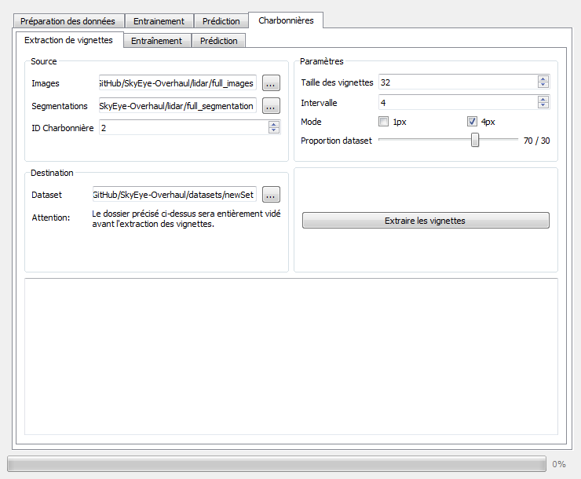
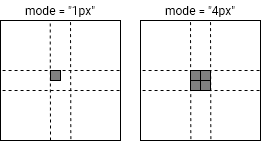
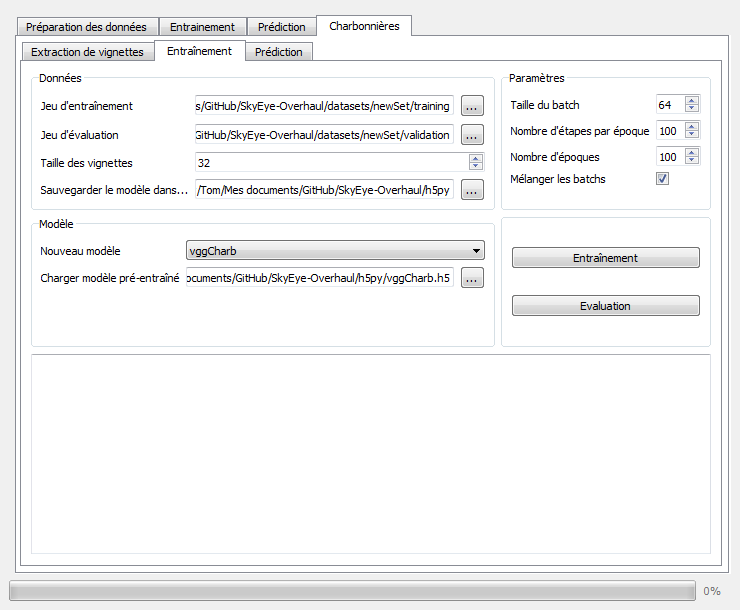
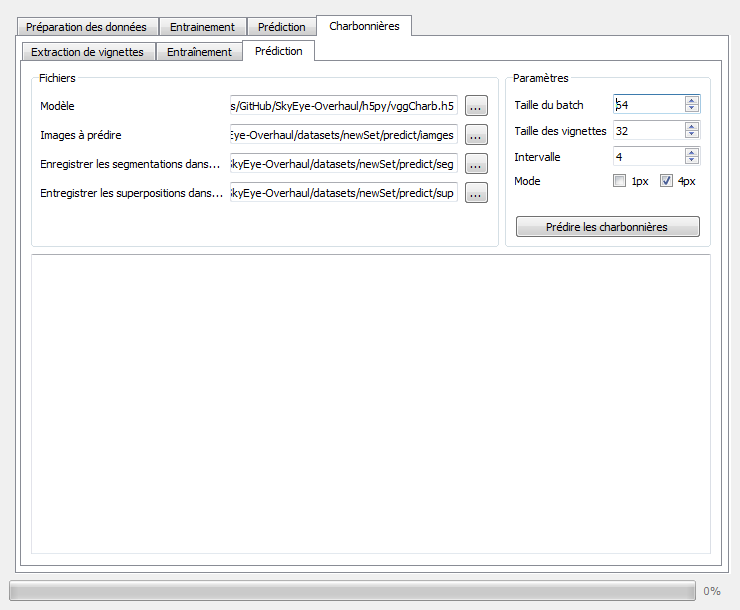

# Manuel d'utilisation SkyEye (Outil "Charbonnières") :book:

L'outil SkyEye permet d'entrainer un modèle de segmentation d'images, d'évaluer ses performances, effectuer des prédictions sur de nouvelles images, et préparer les données en amont de ces opérations.
Le manuel d'utilisation de cet outil est disponible sur le dépôt du projet initial: https://github.com/Millasta/image-segmentation-keras.
**Ce manuel d'utilisation ne concerne que l'onglet "Charbonnières"**, implémenté en 2020-21.

## Extraction des vignettes

La première fonctionnalité de l'onglet "Charbonnières" permet d'extraire des vignettes (des images carrées de petites dimensions) et de former des ensembles de données pour l'apprentissage et l'évaluation d'un modèle.

Dans la partie "**Source**", il faut préciser:
1. Le dossier contenant les images LiDAR sur lesquelles vont être extraites les vignettes
2. Le dossier contenant les segmentations de ces images (Attention: les images et les segmentations doivent avoir le même nom!)
3. L'ID représentant les charbonnières (voir documentation du projet SkyEye). Sur les images contenues dans le dépôt GitHub, celui-ci est toujours **2**.

Dans la partie "**Destination**", il faut préciser le dossier dans lequel sera créé les ensembles d'apprentissage et d'évaluation. Après l'extraction, le dossier suivera la structure suivante:
- train
    - charb
        - *liste des vignettes*
        - [nom_image]_x_y.png
        - ...
    - back
- eval
    - charb
    - back
    
Enfin, la partie "**Paramètres**" permet de préciser:
1. La taille des vignettes. Celle-ci doit être un multiple de 32.
2. L'intervalle (en pixels) entre chaque vignette à extraire. Pour maximiser le nombre de vignettes, fixer l'intervalle à 1 pixel.
3. Le mode de choix de la classe. Si le mode est fixé à "1px", la classe de la vignette sera celle d'un unique pixel au centre de la vignette. Si le mode est fixé à "4px", la classe de la vignette sera "charb" si les 4 pixels centraux représentent une charbonnière, ou "back" dans le cas échéant.
4. La répartition des vignettes entre l'ensemble d'apprentissage et l'ensemble d'évaluation.

Il suffit ensuite d'appuyer sur le bouton "Extraire les vignettes" pour lancer l'extraction.
Le dossier de destination sera vidé (cela peut prendre un peu de temps), et les vignettes seront créées et réparties selon l'arborescence détaillée plus haut.

## Entraînement et évaluation

Le second onglet permet d'entraîner un nouveau modèle et/ou d'évaluer un modèle existant.

Pour entrainer un nouveau modèle, il faudra spécifier:

Dans la partie "**Données**":
1. Le dossier contenant le jeu d'entraînement.
2. Le dossier contenant le jeu d'évaluation. C'est sur les images contenues dans ce dossier que sera évalué le modèle entre chaque époque.
3. La taille des vignettes.
4. Le dossier dans lequel on veut enregistrer le modèle une fois entraîné. Le modèle sera nommé sous la convention suivante: [type_modèle].h5

Dans la partie "**Modèle**":
1. Le type de modèle à entraîner. Actuellement seuls deux architectures sont implémentées:
    - vgg4
    - vgg16

Dans la partie "**Paramètres**":
1. Taille du batch : combien d'images vont être montées en mémoire par itération, une plus grande valeur pourra produire un entrainement de meilleure qualité, mais sera plus couteux en ressources  (RAM et CPU)
2. Nombre d'étapes par époque : nombre d'itérations par entrainement. Le nombre maximum d'étapes par époque est égal au nombre d'images dans le jeu d'entraînement divisié par la taille du batch. Pour utiliser toutes les images disponibles, le fixer à **0**.
3. Nombre d'époques : nombre d'entraînements à effectuer.
4. Mélanger les batchs: si on ne couvre pas la totalité du jeu d'entraînement dans une époque, il peut être intéressant de mélanger les batchs afin que le réseaux de neurones s'entraîne sur plus d'images différentes.

Il suffira ensuite de cliquer sur le bouton "Entraînement" pour lancer l'apprentissage. Le modèle sera sauvegardé à chaque amélioration de sa précision, afin de n'en garder que la meilleure version.

Une fois le modèle entraîner, il est nécessaire de le tester sur une base d'images séparée afin d'en évaluer ses performances. Pour cela, il faut spécifier:
1. Dans la partie "**Modèle**", le modèle qu'on vient d'entraîner. Celui-ci doit être au format *h5*.
2. Dans la partie "**Données**", le jeu d'évaluation sur lequel tester le modèle. Celui-ci peut être le même que le jeu d'évaluation utilisé pendant l'entraînement.

Il suffira ensuite de cliquer sur "Évaluation" pour tester le modèle. Plusieurs métriques (matrices de confusion, précision, rappel, f1-score) seront affichés dans les logs et permettent d'évaluer la qualité du modèle entraîné.

## Prédictions

Le dernier onglet permet d'utiliser un modèle entraîné afin de prédire les segmentations d'une ou plusieurs images LiDAR.

Pour l'utiliser, il faudra spécifier:

Dans la partie "**Fichiers**":
1. Le modèle à utiliser. Celui-ci doit être au format *h5*.
2. Le dossier contenant les images LiDAR à prédire.
3. Le dossier où enregistrer les segmentations obtenues.
4. Le dossier où enregistrer les superpositions obtenues.

Dans la partie "**Paramètres**":
1. La taille du batch.
2. La taille des vignettes.
3. L'intervalle (en pixels) entre chaque vignette.
4. Le mode.

**Attention:** Afin de maximiser la précision des prédictions, la taille des vignettes et le mode doivent être les mêmes que ceux utilisés lors de l'extraction des vignettes.
De plus, utiliser une intervalle plus grand que 1 (pour le mode "1px") ou 2 (pour le mode "4px") accelerera les prédictions mais diminuera la "résolution" des segmentations prédites.

