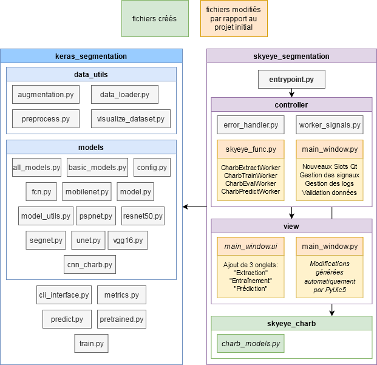

# Outil de segmentation d'image en Deep Learning : SkyEye :small_airplane::eye::earth_africa:


Ce projet est un *fork* du projet https://github.com/Millasta/image-segmentation-keras, lui-même étant un fork du projet https://github.com/divamgupta/image-segmentation-keras : *Implémentation de Segnet, FCN, UNet, PSPNet et d'autres modèles avec Keras.*

Le projet a été réalisé par Tom SUCHEL dans le cadre du **P**rojet **R**echerche et **D**éveloppement (**P**rojet de **F**in d'**É**tude) de la troisième année du cycle ingénieur au département informatique de l'école Polytech Tours, lors de l'année 2020-21. 

L'objectif de ce projet est de rajouter un ensemble de fonctionnalités à l'outil SkyEye, permettant la segmentation automatique des charbonnières sur des images LiDAR.
Le projet initial a été développé par Valentin MAURICE lors de son PRD sur le même sujet, réalisé en 2019-20.


## Prérequis

Le projet a été développé avec une distribution Python 3.6.5 (64bit) sur windows, et nécessite les dépendances suivantes (à retrouver dans requirements.txt) :

- **tensorflow==1.9.0**
- **keras==2.2.5**
- **protobuf==3.6.0**
- six (1.14.0)
- pillow (7.0.0)
- matplotlib (3.1.3)
- scikit-image (0.16.2)
- numpy (1.18.1)
- h5py (2.10.0)
- tqdm (4.43.0)
- pyqt5 (5.14.1)
- opencv-python (4.2.0.32)
- imgaug (0.4.0)
- sklearn (0.0)

**Attention**: Qt 5.15 doit être installé sur l'ordinateur afin de pouvoir éxécuter le logiciel.

## Lancement

Il suffit d'éxécuter *skyeye_segmentation/entrypoint.py* avec Python, l'application devrait s'ouvrir.


## Structure du projet

Le projet est structué de la manière suivante :

- **html/** : contient la documentation générée avec [pdoc](https://pdoc3.github.io/pdoc/) 
- **keras_segmentation/** : sources du projet initial forké
- **log/** : fichiers logs
- **README/** : ressources de ce document
- **skyeye_segmentation/** : source du projet
- **test_keras_segmentation/** : tests unitaires du projet forké
- **test_syeye_segmentation/** : tests unitaires du projet


### Modules

Les modules pythons s'organisent de la manière suivante. Les modules en orange sont ceux qui ont été modifiés depuis la version initiale du projet.



Le module **view** contient un fichier .ui généré avec [Qt Designer](https://build-system.fman.io/qt-designer-download), qui a été automatiquement traduit en .py grâce au convertisseur pyuic5 (contenu dans PyQt5) : 

```python
>>> pyuic5 main_window.ui > main_window.py
```


## Documentation

La documentation disponible dans *html/* a été générée avec [pdoc](https://pdoc3.github.io/pdoc/) : 

```python
>>> pdoc skyeye_segmentation --html
```


## Tests unitaires

Lancer les tests unitaires des nouvelles fonctions du module *skyeye_segmentation* (**se placer dans test_charb_segmentation/**) :

```python
>>> pytest
```


## Qualimétrie

Pour lancer une analyse statique du code avec [PyLint](https://www.pylint.org/) (fichier de configureation : *.pylintrc*) :

```python
>>> pylint --rcfile=.pylintrc skyeye_segmentation > pylint.txt
```

Le rapport PyLint est alors disponible et donne des indications sur la qualité du code analysé, ainsi qu'une note générale :


## Manuel d'utilisation

Voir le [manuel d'utilisation](MANUAL/Manuel.md)


## Téléchargement

Télécharger l'archive de la dernière version [ici](https://github.com/Millasta/image-segmentation-keras/releases).
